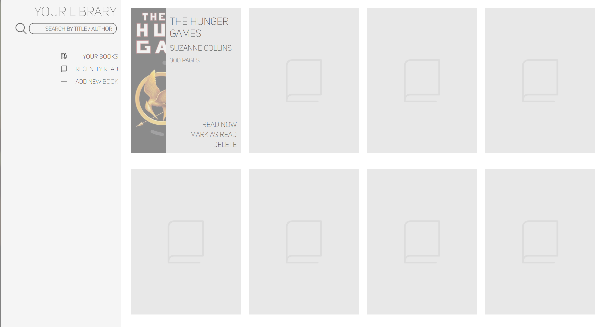

# Library Page

This project is part of a learning exercise instructed by the Odin Project curriculum, a completely free and open source *source* of learning Web Dev, HTML, CSS, JS, and React (my own preference), plus other stuff.

Topic: Objects, Prototypes, Object Constructors in JavaScript

---

## Table of Contents
- [Preview Image](#preview-image)
- [Overview](#overview)
- [Features](#features)
- [Technologies Used](#technologies-used)
- [Things Learned](#things-i-learned)
- [Installation](#installation)
- [Live Demo](#live-demo)
- [Contributing](#contributing)

## Preview Image

## Overview
This project aims to teach me how to design websites with an Object oriented approach, as well as using constructor functions as means of making objects, in JavaScript.

## Features
- Search Book with Search Bar
- View Recently Read
- Add new book to collection
- Mark book as read/Mark as unread
- Delete book from collection
- Icons

## Technologies Used
- **Languages**: JavaScript, HTML, CSS
  

## Things I Learned
- Implementing Constructor functions for easier Object making
- (Later) refactoring code to use Classes and a Module instead of Constructors
- Getter/Setter functions
- "this" keyword and it's context
- IIFE for Modules
- Dynamic DOM element creation
- Event Delegation with Event Listeners
- Input Form Management
- Writing *cleaner* and more *readable* code
- Refactorization of code

## Live Demo
visit the live demo [here](https://zippy0626.github.io/simple-library/).

## Contributing
This is a personal learning project, but feel free to fork or submit issues!